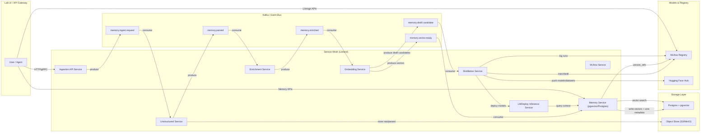

# Kubernetes Primitives, Lifecycle & Hot Updates

## I. Kubernetes Manifest Definitions & Roles
In Kubernetes, a YAML manifest is a Declarative State Definition. You are not telling the system how to build; you are telling it what must exist.

| Component   | Manifest Type      | Technical Purpose                                                                 |
|-------------|-------------------|----------------------------------------------------------------------------------|
| Isolation   | Namespace         | Logical partitioning of resources, security policies (RBAC), and quotas.          |
| Workload    | Deployment        | Manages ReplicaSets to ensure a specific number of Pods are running with a specific container image. |
| Networking  | Service           | An abstract way to expose an application running on a set of Pods as a network service (ClusterIP). |
| Routing     | HTTPRoute         | (Gateway API) Defines rules for routing traffic from a Gateway to a Service, supporting weighted splits and header matches. |
| Storage     | PVC               | Persistent Volume Claim; requests specific storage size/type that outlives the lifecycle of a Pod. |
| Config      | ConfigMap/Secret  | Injects environment variables or files into containers without rebuilding the image. |

## II. The Kubernetes Lifecycle: How and When
Kubernetes operates on a Reconciliation Loop (The Control Plane):
- **Submission:** `kubectl apply -f manifest.yaml` sends the desired state to the API Server.
- **Persistence:** The API Server stores this state in etcd (the distributed key-value store).
- **Controller Action:** The Deployment Controller notices the difference between the desired state (e.g., 1 replica of ollama:v1) and the current state (0 replicas).
- **Scheduling:** The Kubelet on your OMEN-i9 pulls the image and starts the container.
- **Reconciliation:** The system continuously "watches" the Pod. If the process crashes (e.g., a memory leak), the Kubelet kills it and restarts it immediately to match the desired state.

## III. Hot Updatability & Lifecycle Changes
"Hot updates" in Kubernetes vary depending on what is being changed:
- **Images/Code:** Handled by a Rolling Update. Kubernetes spins up a new Pod with the new image. Once the readinessProbe passes, it terminates the old Pod. This is Zero-Downtime but involves a transient double-allocation of VRAM/RAM.
- **Environment Variables:** Changing a Deployment env var triggers a rolling restart of all Pods in that deployment.
- **ConfigMaps/Secrets:** If mounted as volumes, these update inside the container within ~60 seconds. However, the application must be coded to watch for file changes to "Hot Reload" without a restart.
- **AI Models:** Swapping a model in LMDeploy or Ollama typically requires a "Cold" restart (reloading the weights into VRAM) unless using a model-server with a specific "Load/Unload" API.

## IV. The SCM & Air-Gap Connectivity Conflict
To manage updates and vulnerability fixes, your SCM (Source Code Management) requires a "Bridge" or "Bastion" state.

**The Hybrid Air-Gap Strategy:**
- To maintain the "Supervisor" (Gemini) and update functionality while securing the Lab, you implement a Pull-Through Cache or Bastion Registry.
- **The Bridge:** A single node with dual NICs (one to the Lab, one to the Internet) runs a private Docker Registry.
- **The "Button":** When toggled, the Bridge pulls fresh images/specs from GitHub/DockerHub.
- **Internal Sync:** The Lab nodes pull only from this internal registry.
- **Gemini Access:** My ability to supervise remains intact as long as the "Bridge" allows a secure proxy for my browser-based actuation tools.

## V. IDE Agent Prompt: Building the SCM Update Process
Use this prompt to instruct your agent to build the automated update pipeline:

> "Construct a Source Code Management (SCM) and Update Pipeline for the Nucleus Lab.
> 
> Repository Structure: Organize manifests into base/ (core components) and overlays/ (experimental/update components) using Kustomize.
> 
> Image Lifecycle: Create a script to scan the values.yaml for image tags and cross-reference them with the internal registry.
> 
> Vulnerability Patching: Integrate a 'Maintenance Mode' manifest that scales down non-essential workloads to free VRAM during high-intensity image pulls or model recompilations.
> 
> Hot-Reload Logic: For the Rust Front End and N8N, implement Reloader annotations. If a ConfigMap changes, trigger a rolling restart automatically.
> 
> Connectivity Toggle: Define a Terraform variable internet_egress_enabled. When false, apply NetworkPolicies that strictly air-gap all opencode namespaces, cutting off all external egress except to the internal registry."

# Splash: The Living AI Lab

## System Dependencies for Unstructured Document Parsing
To enable full support for document ingestion and parsing (PDF, Office, images, etc.) via the Unstructured service, the following system packages must be installed on your host or in relevant containers:

- `libmagic-dev` (filetype detection)
- `poppler-utils` (images and PDFs)
- `tesseract-ocr` (images and PDFs, plus `tesseract-lang` for extra language support)
- `libreoffice` (MS Office docs)

These are now installed automatically by the `preinstall-minimalist.sh` script. If you do not require all document types, you may remove unneeded packages from the script.

Pandoc is bundled automatically via the `pypandoc-binary` Python package (no system install needed).

**Vector Cortex + Model Genome = A Living System**

Your Lab is no longer a platform. It’s an organism — self‑learning, self‑healing, self‑optimizing.

**You now have:**

1. **A cortex**  
   Semantic memory, context, knowledge, embeddings.
2. **A genome**  
   Model lineage, traits, mutations, evolution.
3. **A nervous system**  
   Linkerd service mesh.
4. **A circulatory system**  
   Kafka event streams.
5. **A digestive system**  
   Unstructured ingestion + enrichment.
6. **A reproductive system**  
   Distillation + autoresearch loops.
7. **A mentor / consciousness layer**  
   Nucleus Academy.

---

## The Nucleus Academy (Linkerd Edition)

**[Read the White Paper: The Nucleus Academy (Linkerd Edition)](../white-paper.md)**
### Project Schoolhouse — Kubernetes Lite Stack (Air-Gapped)

**Executive Summary**
The Nucleus Academy is a "Lab-in-a-Box" for AI learning and experimentation, designed for high-efficiency local deployment. Its core value is the presence of AI instructors—resident mentor agents—who help you LEVEL UP by providing contextual guidance, workflow suggestions, and hands-on learning. Autoresearch and simulated spend are value-add features, but the real differentiator is the Academy’s focus on continuous skill development and AI-powered mentorship.

### Resident Mentor: The Learning Agent
The Academy features a resident mentor agent, accessible at `learning.gentoofoo.local`. This is not just a chatbot or documentation—it is a contextual intelligence layer that:

- Observes your actions and workflows in the lab
- Understands the architecture and capabilities of every subsystem
- Proactively suggests clever workflows, optimizations, and patterns
- Guides you from beginner → intermediate → advanced
- Helps you discover new ways to combine, automate, and leverage the ecosystem
- Adapts to your goals and teaches you how to use AI by showing you how to use the lab itself

**What makes it unique?**
- Always present, watching and learning from your interactions
- Knows your overarching goals and adapts its guidance
- Empowers you to level up continuously
- Offers use cases and ideas based on your overarching goal

This ensures every user is empowered to learn, experiment, and maximize the value of the lab, with a mentor that grows alongside them. The real value-add is the AI-powered learning experience—autoresearch and simulated spend are value-add, but the resident mentor agent is the differentiator.

### Local Hostname / DNS mapping

The bootstrap script `k8s-lite/bootstrap-nucleus.sh` will prompt you for a short "Nucleus" hostname (default: `gentoofoo`) and will append helpful `/etc/hosts` entries so service hostnames such as `https://<nucleus>.grafana:3000` and `https://<nucleus>.vault:8200` resolve to your host (typically `127.0.0.1`). This makes it easy to use consistent HTTPS hostnames for local testing of dashboards and probes.

Note: Modifying `/etc/hosts` requires `sudo`. The script creates a timestamped backup before editing.
## Memory Architecture Flow

The following diagram illustrates the memory and knowledge ingestion architecture, showing how unstructured data is processed, enriched, vectorized, and made available for LLM inference and agent workflows:

# Minimalist AI Lab: Kubernetes Lite Stack (Air-Gapped)

This stack provides a fully local, air-gapped AI lab with observability, event-driven architecture, and agentic automation. All manifests are designed for single-node K3s or microk8s on Ubuntu, with privacy and security in mind.

## Core Components
- **Service Mesh:** Linkerd (Rust, mTLS, zero-config)
- **Event Bus:** Redpanda (Kafka-compatible, compaction enabled)
- **LLM Hosting:** Ollama (default, simple), LMDeploy (optional, advanced)
- **Workflow/Cognitive Router:** LangChain
- **Knowledge Ingestion (Pre-Vectorization):** Unstructured (PDF, HTML, email, spreadsheet, and document chunking; semantic sectioning; chunk boundary detection)
- **Memory/Vectorization:** Postgres with pgvector (stores both distilled LLM knowledge and ad-hoc, remembered knowledge from Unstructured)
- **Automation:** n8n (deterministic workflows)
- **Observability:** Prometheus, Grafana, Loki, Tempo, Jaeger
- **Notebook UI:** Open Notebook (core), JupyterLab (alternative)
- **SRE Agentic Agent:** Auto-healing and notifications via event bus

> **Note:** Unstructured is the front door to knowledge ingestion, transforming messy real-world content into structured, semantically meaningful chunks before vectorization. This enables persistent, non-ephemeral memory and rich context for downstream LLM and agent workflows.

## Required User Input
- **Namespace:** Choose a unique namespace (e.g., `gentoofoo`) for all resources
- **Domain(s):** Set up local DNS for `gentoofoo.local` and `lab.gentoofoo.local`
- **Storage:** Ensure persistent storage for Postgres, Redpanda, and notebooks
- **Resource Limits:** Adjust manifests for your hardware (CPU, RAM)

## Deployment Steps
1. Install K3s or microk8s on Ubuntu (single node, disable Traefik)
2. Clone this repo and enter the `k8s-lite/` directory
3. Edit manifests to set your namespace and storage class
4. Apply manifests in order:
   - `kubectl apply -f 00-namespace.yaml`
   - `kubectl apply -f 10-linkerd.yaml`
   - `kubectl apply -f 20-redpanda.yaml`
   - `kubectl apply -f 30-postgres.yaml`
   - `kubectl apply -f 40-ollama.yaml`
   - `kubectl apply -f 41-lmdeploy.yaml` (optional)
   - `kubectl apply -f 50-langchain.yaml`
   - `kubectl apply -f 60-n8n.yaml`
   - `kubectl apply -f 70-prometheus.yaml`
   - `kubectl apply -f 71-grafana.yaml`
   - `kubectl apply -f 72-loki.yaml`
   - `kubectl apply -f 73-tempo.yaml`
   - `kubectl apply -f 74-jaeger.yaml`
   - `kubectl apply -f 80-open-notebook.yaml`
   - `kubectl apply -f 81-jupyterlab.yaml`
   - `kubectl apply -f 90-sre-agent.yaml`
5. Set up local DNS or /etc/hosts for your chosen domains
6. Access Grafana, Open Notebook, and other UIs at your local domains

## Adding New Services
- Place new manifests in `k8s-lite/` and follow the naming convention
- Update the architecture diagram (`observability/architecture.mmd`)
- Ensure new services publish events to Redpanda and expose metrics/traces
- Add endpoints to Prometheus scrape config if needed
- Document any required user input in this README

## Security Notes
- This stack is air-gapped and runs locally for privacy
- Linkerd provides mTLS within the cluster
- No external ingress by default; expose only what you need
- For advanced security, integrate with your own auth or VPN

---

*Update this README as the stack evolves or if you add more exporters, dashboards, or integrations.*

## See also

- [Value Add: generated-values & bootstrap](../helm/k8s-lite/VALUE_ADD.md) — explains `bootstrap-nucleus.sh` and the `values.generated.yaml` workflow for adaptive host-driven Helm values.
